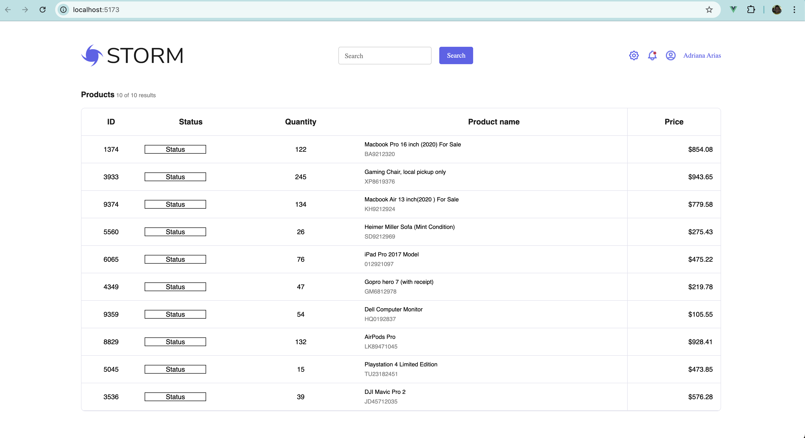
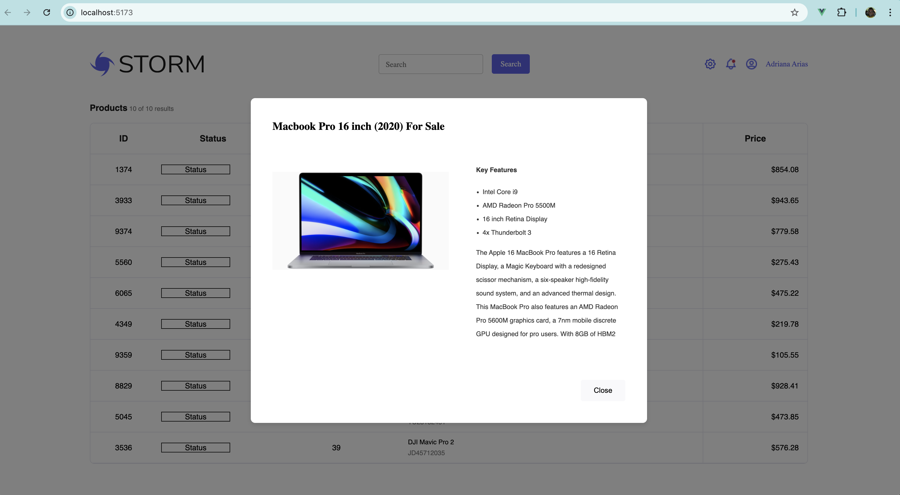

# Project: Tucows Product Catalog Web Application

## Overview

This project is a **Product Catalog Web Application** built using **Vue 3** and **SCSS**, designed to help users search, sort, and view product details in a table.

## Table View



## Modal View




## Features

1. **Product Table**:
   - Displays a list of products with their name, quantity, status, price, and ID.
   - Supports sorting by name, quantity, and price through clickable table headers.
2. **Search Functionality**:
   - Users can filter products using a search bar.
3. **Product Count**:
   - Displays the number of products currently shown and the total available.
4. **Product Details Modal**:
   - Shows detailed information about a product, including its title, description, and image.
5. **Responsive Design**:
   - Work in progress


## Technologies Used

- **Vue 3**: For building the user interface.
- **SCSS**: For styling the application with maintainable and reusable styles.
- **JavaScript**: For handling application logic.


## Setup Instructions

### Prerequisites

Ensure you have the following installed:

- Node.js (v22 or higher)
- npm or yarn

### Steps

1. Clone the repository:
   ```bash 
   git clone https://github.com/JonBoim27/tu-vue-ui.git
   ```
2. Navigate to the project directory:
   ```bash
   cd the folder you cloned the repo to
   ```
3. Install dependencies:
   ```bash
   npm install
   ```
4. Run the development server:
   ```bash
   npm run dev
   ```
5. Open your browser and navigate to:
   ```bash
   http://localhost:5173/
   ```

## JSON Data

The application uses mock JSON data to simulate API responses. Below is an example of the data:

```json
[
  {
    "product": "Macbook Pro 16 inch (2020) For Sale",
    "serial": "BA9212320",
    "id": 1374,
    "quantity": 122,
    "total": 854.08,
    "image": "https://example.com/macbook.jpg"
  },
  {
    "product": "Gaming Chair, local pickup only",
    "serial": "XP8619376",
    "id": 3933,
    "quantity": 245,
    "total": 943.65
  }
]
```

## Notes

- Followed the design guidelines from the provided Figma link: [Figma Design](https://www.figma.com/file/qcDdHgyNuZ0M1Qp3JUdrPa/Storm).
- Avoided using UI libraries like Bootstrap or Tailwind CSS; styled the components manually using SCSS.

## Future Enhancements

- Fully responsive implementation
- Displays a placeholder image if no product image is available
- Status column properly styled and dynamic rendering based on product status
- Unit and End to End testing
- Add pagination to handle large datasets efficiently
- Integrate with a real API to fetch product data dynamically
- Refactor to utilize more SCSS variables and move toward rem instead of px for styling

## License

This project is licensed under the MIT License. See the `LICENSE` file for details.